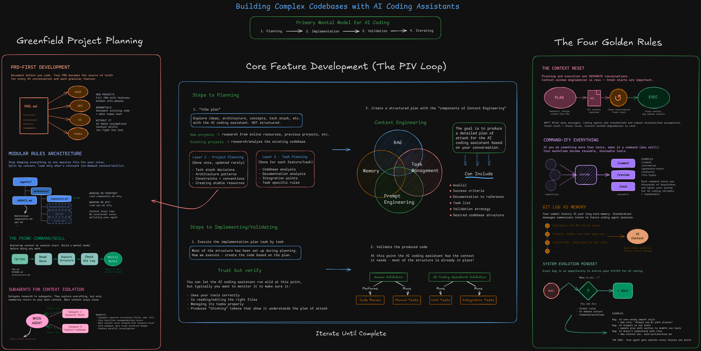

# Agentic Coding Boilerplate

A stack-agnostic starting point for building any project with [Claude Code](https://docs.anthropic.com/en/docs/claude-code/overview). It contains no application code, only the **AI layer**: slash commands, skills, and a rules template that turn Claude Code into a structured, repeatable engineering workflow.

Based on Cole Medin's [AI Coding Summit 2026 workshop](https://github.com/coleam00/ai-coding-summit-workshop-2).



## The PIV Loop: Plan, Implement, Validate

The workflow that separates productive AI-assisted development from vibe coding:

1. **Plan** – Create context-rich implementation plans that give the agent everything it needs to succeed on the first pass. Not "build me X", but structured plans with architecture references, code patterns, validation commands, and acceptance criteria.
2. **Implement** – Delegate all coding to the agent. It follows your plan, which includes the validation strategy, so it can check its own work along the way.
3. **Validate** – The validation pyramid. The agent handles linting, type checking, tests, and acceptance criteria. You step in at the top for code review and manual testing.

### Principles

- **Context reset** – Start a fresh session between planning and implementation. Don't pollute the implementation context with all the research from planning.
- **Git log as memory** – Commit history is context the agent can use. Keep it atomic and descriptive.
- **Commandify everything** – Turn repeatable workflows into slash commands. Every command in this repo is a starting point you should adapt.
- **System evolution** – Every mistake the agent makes is a chance to fix the root cause in your rules, commands, or skills so it never happens again.
- **The sandwich principle** – You own planning and validation; the agent owns implementation.

## Quick Start

### 1. Clone and rename

```bash
git clone <this-repo> my-project
cd my-project
rm -rf .git && git init
```

### 2. Describe your idea

Open Claude Code in the project folder and just talk. Explain what you want to build, who it's for, and any constraints or stack preferences. Let Claude ask clarifying questions until the picture is clear.

### 3. Create the PRD

```
/create-prd PRD.md
```

Generates a full Product Requirements Document from the conversation: scope, user stories, architecture, tech stack, implementation phases, and success criteria. Review it and edit anything that doesn't match your intent. This file becomes the north star for every later step.

### 4. Plan the first phase

Start a **new session** (context reset), then:

```
/prime
/plan-feature Phase 1 from PRD.md
```

Produces a detailed plan in `.agents/plans/`. Read it. Fix anything wrong before implementing.

### 5. Implement

Start a **new session**, then:

```
/execute .agents/plans/<plan-name>.md
```

The agent works through the plan task by task and runs the validation commands it defined.

### 6. Validate

```
/validate .agents/plans/<plan-name>.md
/code-review
/code-review-fix
```

`/validate` runs the whole pyramid: lint, types, tests, build, smoke test, and checks the plan's acceptance criteria. `/code-review` reads the diff against your project rules and writes a report to `.agents/code-reviews/`. `/code-review-fix` works through that report.

For web apps, add:

```
/e2e-test
```

It launches parallel agents that research the codebase, then drive a real browser through every user journey, taking screenshots and verifying database state. Requires a web frontend and Linux, WSL, or macOS.

You still do the final manual test and the last read of the diff. That's the top of the pyramid.

### 7. Commit

```
/commit
```

### 8. Create project rules

Once real code exists:

```
/create-rules
```

Analyzes the codebase and generates `CLAUDE.md` at the project root from [.claude/CLAUDE-template.md](.claude/CLAUDE-template.md). Keep it updated as conventions emerge.

Repeat steps 4 to 7 for every subsequent phase or feature. Use `/init-project` whenever you need to set the project up locally from scratch.

## Repository Structure

```
.
├── .agents/
│   ├── plans/                      # Generated implementation plans
│   └── reference/                  # On-demand rules split by concern (api.md, components.md, ...)
├── .claude/
│   ├── CLAUDE-template.md          # Template used by /create-rules
│   ├── settings.json.example       # Starting point for permissions and hooks
│   ├── commands/
│   │   ├── prime.md                # /prime            Load codebase context
│   │   ├── create-prd.md           # /create-prd       Generate a PRD from conversation
│   │   ├── plan-feature.md         # /plan-feature     Create an implementation plan
│   │   ├── execute.md              # /execute          Execute a plan step by step
│   │   ├── validate.md             # /validate         Lint, types, tests, build, acceptance criteria
│   │   ├── code-review.md          # /code-review      Review the diff against project rules
│   │   ├── code-review-fix.md      # /code-review-fix  Fix findings from a review
│   │   ├── create-rules.md         # /create-rules     Generate CLAUDE.md
│   │   ├── init-project.md         # /init-project     Set up and start locally
│   │   └── commit.md               # /commit           Create an atomic commit
│   └── skills/
│       ├── agent-browser/          # Browser automation via agent-browser CLI
│       └── e2e-test/               # End-to-end testing orchestration
├── .env.example                    # Every env var the app needs, with placeholders
├── .gitignore
└── README.md
```

## Commands

| Command | Purpose | When to use |
|---------|---------|-------------|
| `/prime` | Load full codebase context into the agent | Start of a session, before planning |
| `/create-prd` | Generate a Product Requirements Document | Starting a new project |
| `/plan-feature` | Create a detailed implementation plan | Before implementing any feature |
| `/execute` | Execute a plan step by step with validation | After the plan is reviewed |
| `/validate` | Run lint, types, tests, build and check acceptance criteria | After `/execute`, before review |
| `/code-review` | Review changes against `CLAUDE.md` and reference docs, write a report | Before committing |
| `/code-review-fix` | Fix the findings from a review, then re-validate | After `/code-review` |
| `/create-rules` | Generate `CLAUDE.md` from the codebase | After the first implementation, then as needed |
| `/init-project` | Install deps, start servers, validate setup | First local setup |
| `/commit` | Stage changes and create an atomic commit | After completing and validating work |

## Skills

| Skill | Purpose |
|-------|---------|
| **agent-browser** | Automates browser interactions: navigate, fill forms, click, screenshot. Used for manual verification. |
| **e2e-test** | Full end-to-end testing: parallel research agents, then systematic browser testing of every user journey with database validation. Invoke explicitly with `/e2e-test`. |

## Environment Variables: Keep .env.example Complete

`.env.example` is not just documentation. It's a guardrail against a specific failure mode.

When an agent needs a database URL, an API key, or a service endpoint and can't find it, it rarely stops and asks. It invents a variable name, writes a stub, or mocks the whole integration. Then it runs the tests against the mock and reports that everything works. You find out later that nothing was ever wired to a real service.

To prevent that:

- **List every variable** the app reads in `.env.example`, with a placeholder and a comment on where the real value comes from.
- **Keep a real `.env`** locally before running `/execute`. Point it at a real dev database and real sandbox credentials, never at production.
- **Ask the agent to fail loudly** when a variable is missing. A startup check that throws is better than a silent fallback to a mock.
- **Treat "I mocked the service" in an execution report as a red flag.** Check whether the mock was in the plan, and if not, wire the real thing before validating.

`/init-project` copies `.env.example` to `.env` as its first step, and `.gitignore` keeps `.env` out of the repo while leaving `.env.example` tracked.

## Making It Yours

- **Adapt the commands.** They are plain markdown prompts in `.claude/commands/`. Edit them whenever the agent makes a mistake that a better instruction would have prevented.
- **Add skills.** Drop a folder with a `SKILL.md` into `.claude/skills/` for any specialized capability.
- **Split rules by concern.** Don't dump everything into one big `CLAUDE.md`. Put focused docs in `.agents/reference/` (for example `components.md`, `api.md`, `database.md`) and have `CLAUDE.md` link them under "On-Demand Context". The agent then loads only what the current task needs. See [.agents/reference/README.md](.agents/reference/README.md).
- **Configure the harness.** Copy `.claude/settings.json.example` to `.claude/settings.json` and trim the permission list to your stack. Add hooks (for example an auto-formatter after edits) once you have something worth automating.
- **Evolve the system.** When `/code-review` finds a bug that a clearer rule would have prevented, fix the rule, not just the bug. That's what makes the agent more reliable over time.

## Requirements

- Git
- Claude Code
- The runtime for whatever stack you choose (Node.js, Bun, Python with uv, etc.)
- For `/e2e-test`: Linux, WSL, or macOS and `npm install -g agent-browser`
